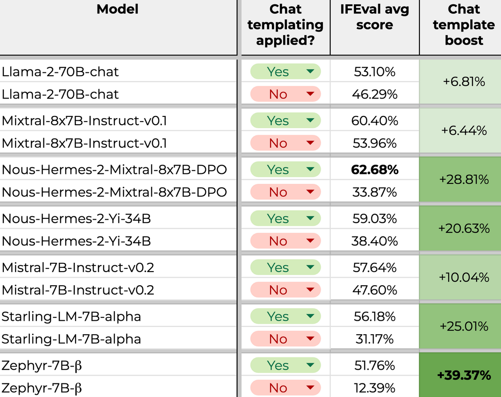

Chat templates are used in chat models such as ChatGPT, Qwen to structure multi-turn conversations.

## Example

Let's start with a simple chat:

```python
chat = [
{"role": "system", "content": "You are a helpful assistant."},
{"role": "user", "content": "What is the capital of France?"},
{"role": "assistant", "content": "Paris is the capital of France."},
]
```

## Applying a Chat Template

To apply a template we can call the method `tokenizer.apply_chat_template()` like this:

```python
from transformers import AutoTokenizer
model_id = "LiquidAI/LFM2-350M"
tokenizer = AutoTokenizer.from_pretrained(model_id)
inputs = tokenizer.apply_chat_template(chat, tokenize=False)
print(inputs)
```

This produces the following text:

```bash
<|startoftext|><|im_start|>system
You are a helpful assistant.<|im_end|>
<|im_start|>user
What is the capital of France?<|im_end|>
<|im_start|>assistant
Paris is the capital of France.<|im_end|>
```

## How it Works

It assigns roles such as `system`, `user`, `assistant`. Basically it is as follows:

- `system`: The instruction to control the LLM behavior
- `user`: The user question to the LLM
- `assistant`: The LLM response

Some models may support additional roles, such as `tool` for tool-calling contexts.

## Under the Hood

Under the hood, the tokenizer uses `jinja` to handle chat templates. It can be seen in the model repo on HF in the [tokenizer_config.json](https://huggingface.co/madoss/LFM2-2.6B-FRMOO-V2/blob/main/tokenizer_config.json) file or [chat_template.jinja](https://huggingface.co/madoss/LFM2-2.6B-FRMOO-V2/blob/main/chat_template.jinja) file.

Here’s a simple example of what a Jinja-based chat template might look like inside a model:

```bash
{{bos_token}}{{'<|im_start|>' + message['role'] + '

' + message['content'] + '<|im_end|>' + '

'}}{{ '<|im_start|>assistant

' }}
```

## What If a Model Doesn’t Have a Chat Template?

Not every model supports chat formatting.
If the model does not have a chat template like `openai-community/gpt2`, calling the method raises `ValueError` like this:

```bash
ValueError: Cannot use chat template functions because tokenizer.chat_template is not set and no template argument was passed! For information about writing templates and setting the tokenizer.chat_template attribute, please see the documentation at https://huggingface.co/docs/transformers/main/en/chat_templating
```

In such cases, you can either:

- Manually define your own Jinja template, or
- Use a text format template

Learn more about [chat_templating](https://huggingface.co/docs/transformers/main/en/chat_templating)

## Why Templates Matter

Most chat-focused LLMs are trained with a specific template. Using a different one at inference or fine-tuning time can degrade performance.

If your input doesn't match the format the model was trained on, it might misunderstand the structure of the conversation, confuse roles, or produce weaker responses.

## A Quick Experiment

For this purpose, [Daniel Furman](https://github.com/daniel-furman) made an experiment and shared some interesting results in this [GitHub issue conversation](https://github.com/EleutherAI/lm-evaluation-harness/issues/1098#issuecomment-1953068243).

Below is a table from his results:



It's easy to see from the table that using the right template has a big effect on the quality of the generation.

That's why, when fine-tuning or evaluating chat-based models, **matching the training-time template** is crucial.

## Conclusion

Chat templates are a small but critical detail when working with modern LLMs. Using the correct template when fine-tuning, evaluating, or prompting a model ensures that the model interprets your input as intended and produces better results. When building training pipelines or evaluation harnesses, make template handling a first-class concern, not an afterthought.
